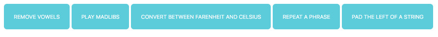

# soc-week-2-project
> Starter Code exercises to practice javascript coding and learn how to model the listener, handler and logic of the javascript code of webpages.

## Table of contents
* [General info](#general-info)
* [Screenshots](#screenshots)
* [Technologies](#technologies)
* [Setup](#setup)
* [Features](#features)
* [Status](#status)
* [Inspiration](#inspiration)
* [Contact](#contact)

## General info
The purpose of the project is to start learning and using javascript on webpages, use built in functions to process numbers, strings and to cast between data types.

## Screenshots

## Technologies
* HTML5
* CSS3
* git
* javascript

## Setup
You can clone or fork this repository and test the files.

## Features
The project features a web site with:
* devowel function to remove vowels from strings
* madlib function to process input string in the requested output string
* pad-left function to add a padding character to the start of a string
* repeater to repeat a string a specified number of times
* temp-converter to convert between fahrenheit and celsius temperature units 

## Status
Project is: finished, final version.

## Inspiration
[this tutorial by mmtuts](https://www.youtube.com/watch?v=qQEYAOPWDzk)

## Contact
Created by [@ferrycosv](www.github.com/ferrycosv) - feel free to contact me!